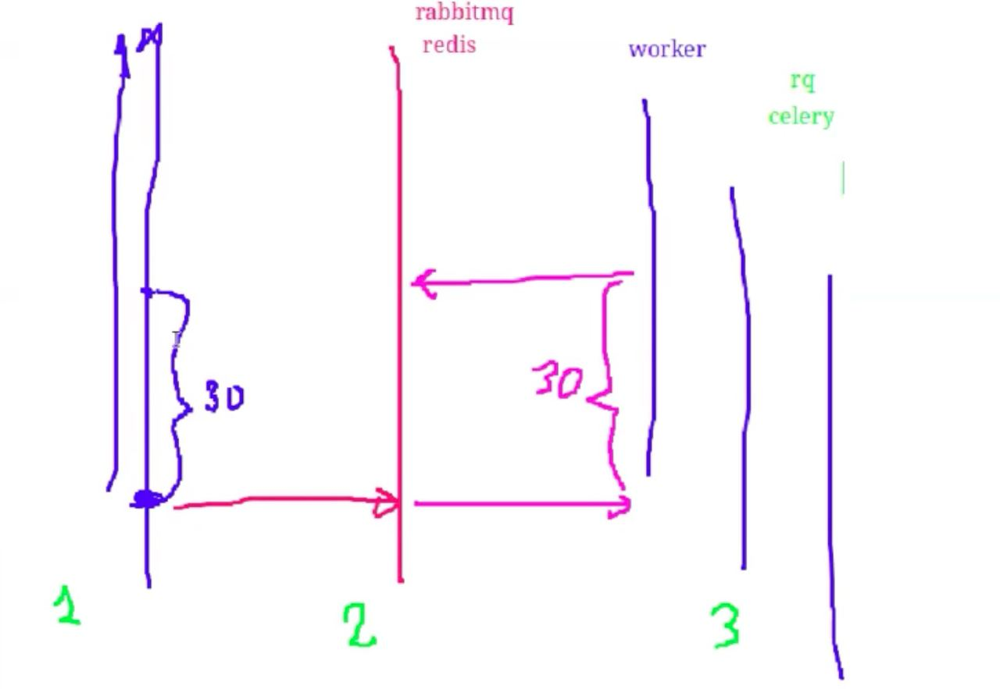

# DJANGO и отложенные задачи

- научиться откладывать ресурсозатратные задачи

--- celery и rabbitmq  
--- отправка электронной почты в неблокирующем режиме  
--- проверка статуса отложенной задачи  

Django Sending message
https://docs.djangoproject.com/en/5.0/topics/email/

```python
def send_admin_message():
    send_mail(
        "Admin message",
        "Incoming message",
        "admin@zoo.com",
        ["admin@zoo.com", "help@zoo.com"],
        fail_silently=False,
    )
```

**Python --> Rabbitmq (Redis) --> Celery (RQ)**


_Rabbitmq_  
https://www.rabbitmq.com  
Через Docker: https://hub.docker.com/_/rabbitmq  
Docker compose: https://x-team.com/blog/set-up-rabbitmq-with-docker-compose/  

_Celery_  
https://docs.celeryq.dev/en/stable/django/index.html  

Запустить Worker:  
`celery -A proj worker -l INFO`  


### Если рассматривать запуск всех связанных приложений через docker compose
1. postgres
2. django-backend + gunicorn (uwsgi) - celery
3. nginx (apache)
4. celery

СБОРКИ:  
https://tejasmandre.vercel.app/read/use-docker-with-django-celery-rabbitmq-nginx-postgresql-simplest-explanation
https://gist.github.com/nolram/58244e203865b914cc0b14b64391741f

В настройки проекта для получения статусов/результатов celery задач:  
`CELERY_RESULT_BACKEND = 'rpc://'`  


